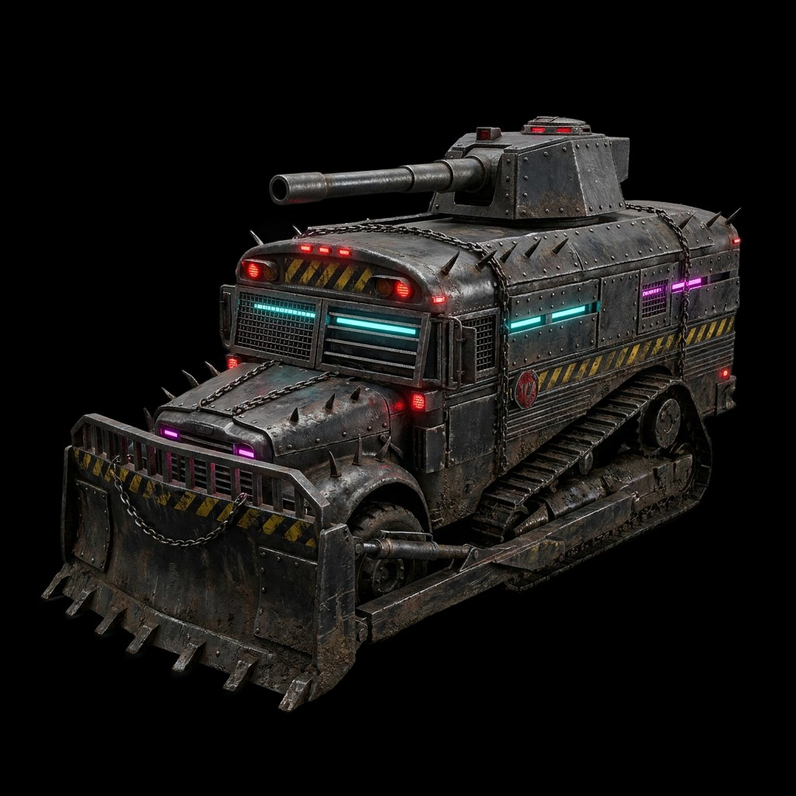

# Art direction: the north star

> **Source of truth for the game's style and setting.** Decided by the lead on 2026-09-14. Every stream that
> makes or places art (look & feel, assets, garage, HUD, marketing) designs toward this. It sits *on top of*
> the established cyberpunk theme (neon palette, the mavlink-hud HUD language in `streams/archive/round1/look_and_feel.md`);
> it doesn't replace it.

The lead, on seeing this concept: *"the death race prison dozer absolutely captures the vibe of the entire game!"*

And after seeing it in the game (2026-09-15): *"the agent developing assets totally discovered the exact vibe we want
for the game with the ridiculous up-armored bus. What made Mad Max and Death Race so good was the over-the-top
eccentric vehicles. This makes it go from a nerdy army game to a fun game"* (in the spirit of classic Metal Gear
Solid). **Over-the-top and eccentric is the point:** every unit should be a memorable character, a little
ridiculous, and still grounded in real, filthy materials.

## The vibe in one paragraph

**Death Race is the spine, Mad Max is the build method, Blade Runner is the light.** Every war machine is a
**repurposed civilian or industrial vehicle** (a prison transport, a mining bulldozer, a school bus, a garbage
truck, a tow rig), converted by whoever runs the arena into a gladiator weapon: riveted slab armor bolted over
the original body, grilles over the windows, chains, short brutal spikes, a dozer blade or ram, tracks
grafted under a road chassis. The materials are **real and filthy**: blackened gunmetal, grime, rust, oil,
worn yellow-black hazard stripes. It's lit like a **Blade Runner night**: harsh magenta and cyan neon light
bars glowing behind grilles and along seams, red warning lights, amber beacons. **Photoreal and grounded, never
cartoon or toy-like.**

## Rules for every piece of art

| Do | Don't |
|---|---|
| Base each vehicle on a recognizable real vehicle that's been brutally converted (you should be able to tell what it used to be) | Invent clean sci-fi hovertanks or generic "cool tanks" |
| Riveted slab armor, steel grilles over openings, welded chains, short spikes, dozer blades and rams, sheet-metal track skirts | Smooth, sleek, or pristine surfaces |
| Blackened gunmetal and dark steel as the base; rust, grime, oil, soot as the wear | Bright or saturated base paint; plain flat colors |
| Worn **yellow-black hazard stripes** as the recurring graphic motif | Logos, readable text, clean decals |
| **Neon lives behind or inside things**: light bars behind grilles, strips in armor seams, magenta + cyan, plus red warning and amber beacon lights | Neon as outlines on everything, or a cartoon glow |
| Heavy, low, wide, top-heavy silhouettes that read from an RTS camera; a distinct turret or weapon on top | Thin, spindly, or detail-only silhouettes that vanish at 40 m |
| Photoreal, gritty, cinematic concept art as the reference target | "Stylized", "toon", "low-poly-looking" style (the first Meshy concept was rejected for looking like a cartoon) |

**Paint and team identity** (the lead's standing direction): players **paint the whole vehicle** (cosmetic, over
the grime), and **friend or foe is shown by accent lights** (the neon light bars and warning lights), not by hull
color. The materials and wear stay the same whatever the paint.

**The arena follows the same logic:** a repurposed industrial site (a prison yard, quarry, scrapyard, or rail
depot) turned into a night-time **gladiator venue with stands full of cheering crowds** (the lead, 2026-09-15):
floodlights, chain-link, concrete barriers with hazard stripes, shipping containers, neon signage behind grilles,
wet reflective ground with real texture. It must be **lit well enough to read the fight** on a phone; the neon is
mood, not the only light.

## The prompt that produced it (reuse its structure)

Meshy text-to-image, `nano-banana-pro`, task `01a09fec-d5c3-700a-bce1-3cdf54384292`:

> Photorealistic concept art of an arena death-race battle tank, Death Race meets Mad Max. A heavy tracked war
> machine converted from an armored prison transport and a mining bulldozer: thick riveted slab armor, narrow
> slit viewports behind steel grilles, welded chains, short brutal spikes, sheet-metal skirts over the tracks,
> blackened gunmetal with worn yellow-black hazard stripes, grime and rust. Squat heavily armored turret carrying
> a long thick-barreled cannon. Harsh neon accents in the Blade Runner style: magenta and cyan light bars behind
> the grilles and red warning lights. Full vehicle in frame, three-quarter front view from slightly above,
> isolated on a plain dark grey studio background, no ground, no people, no text, no logos. Photorealistic,
> gritty, high detail, cinematic lighting, grounded real-world materials.

For a new unit, keep everything and swap the **base vehicle** and the **weapon**. Round-2 roster ideas
([game_design.md](game_design.md)):

| Unit | Base vehicle idea | Weapon (must read at RTS distance) |
|---|---|---|
| Scout | armored rally truck or dune buggy, roll cage and spotlights | a machine gun **welded to the hood**, no turret |
| Tank | the prison-bus dozer (done) | long cannon on a squat, slow turret |
| IFV | armored school bus or garbage truck with slat armor | a fast 30 mm autocannon turret |
| Artillery | crane carrier or cement mixer | a mortar battery on the bed |
| Lancer | power-utility or cherry-picker truck with coils | a laser emitter on the boom |

Prompt library and pipeline: `streams/references/asset_prompts.md`. **Every new concept goes to the lead for review
before image-to-3D** ([workstreams.md](workstreams.md) "Lead gates"): 2–3 directions per slot on a tap-to-approve
review page, the process in [streams/references/concept_review.md](streams/references/concept_review.md).

## First production unit

The concept above is now in the game as theme `prison_dozer` (Meshy image-to-3D, split into hull / turret / cannon):
`make assets-unit THEME=prison_dozer` renders it. How it was made and what to reuse: `streams/archive/round1/assets.md` (update
2026-09-14) and `streams/references/asset_prompts.md`.

## Round 2 production (art stream, 2026-09-14)

The lead reviewed 17 concepts on a review page and approved one per slot. They're in the game now:
- **The roster** (theme `roster`, `make assets-roster`): scout = caged dune buggy with a nose gun, IFV = armored
  garbage truck with a 30 mm turret, artillery = crane carrier with a mortar rack, Lancer = transformer flatbed with a
  coil emitter. Team identity is the model's own neon tinted per team, plus the underglow.
- **The arena kit** (theme `arena_kit`, `make assets-arena-kit`): container and blast barrier cover, container
  grandstands with an instanced cheering crowd, a gate, and floodlight towers.
- **The floor:** CC0 cracked asphalt with baked concrete slabs, oil, skid marks, worn hazard paint, drains, and
  floodlight pools.
- The concept images and the lead's decisions are in `assets/review/`; every new concept goes through
  `make art-review` first.

## Where this is referenced

`HANDOFF.md`, `vision.md` (the vibe), `game_design.md`, `workstreams.md` (product constraint 2), `streams/art.md`,
`slot_contracts.md`, `streams/references/asset_prompts.md`. Update those links if this file moves.
