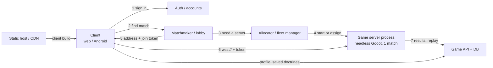

# How Online Games Run Servers (and Our Plan)

A primer for a programmer who knows web backends but not game backends,
followed by the staged plan for Tank Squad. Read before any networking or
deployment work.

---

## 1. Who is in charge? Topologies

| Topology | How it works | Used for | Verdict for us |
|---|---|---|---|
| **Peer-to-peer / lockstep** | Every client runs the full sim from shared inputs; it must be deterministic | Classic RTS (StarCraft, Age of Empires) | ❌ Godot physics isn't cross-platform deterministic; cheating is easy |
| **Listen server** | One *player's* machine hosts; others connect | Casual co-op, LAN games | ❌ A browser can't accept incoming connections; the host has an advantage |
| **Dedicated authoritative server** | A server process owns the true game state; clients send intent and render what the server says | Almost every competitive online game | ✅ **Ours** |

"Authoritative" means **the client never decides outcomes.** A client says "I'm
pressing forward" (or, in squad mode, "here is my doctrine"). The server decides
where the tank actually is and whether the shell hit. That's the whole
anti-cheat foundation.

## 2. The game loop over a network

```
client                                server (fixed tick, e.g. 30 Hz)
  │  input/intent (TankCommand) ──────▶ │ apply latest intent per player
  │                                     │ step simulation one tick
  │ ◀────── snapshot (positions, hp…)   │ send state to each client
  │ render ~100 ms in the past,
  │ interpolating between snapshots
```

Vocabulary you'll meet:
- **Tick rate**: how often the server simulates (20–60 Hz). Higher costs more CPU and bandwidth.
- **Snapshot interpolation**: clients render slightly in the past, blending between two known snapshots, so motion is smooth despite packets arriving irregularly. **We need this.**
- **Client-side prediction + reconciliation**: the client moves *its own* unit immediately and corrects when the server disagrees. Essential for twitchy shooters. **Tanks are slow, and squad mode has no direct control, so we can likely skip it.** That's a big simplification.
- **Lag compensation**: the server rewinds time to judge hits from the shooter's point of view. Also probably unnecessary for us.
- **Interest management**: only send each client what it can/should see. Needed for fog of war (don't send hidden enemy positions, or a hacked client reveals them).

**In Godot terms:** `MultiplayerAPI` with RPCs, plus `MultiplayerSpawner` (replicates
node creation) and `MultiplayerSynchronizer` (replicates properties at an interval,
with per-peer visibility filters for interest management). The transport for us is
**`WebSocketMultiplayerPeer`**, because browsers can't use raw UDP (Godot's default
ENet). `WebRTCMultiplayerPeer` is a later option if WebSocket latency hurts; it's
UDP-like, but needs a signaling server.

## 3. The pieces of a real online game backend

A game server process is only one box. A full service looks like this:



| Piece | Job | Examples in industry |
|---|---|---|
| Static host / CDN | Serves the web build (`index.html`, `.wasm`, `.pck`) | Any web server, Cloudflare, GCS bucket |
| Auth / accounts | Who is this player? Issues tokens | Firebase Auth, Google Sign-In, your own |
| Game API + database | Profiles, saved doctrines, match history, rankings | Normal web backend (Postgres + an API) |
| Matchmaker / lobby | Groups players into a match (skill, region, mode) | Nakama, Open Match, custom |
| Allocator / fleet manager | Starts a game-server process (or picks an idle one), returns its address | Agones (Kubernetes), managed game hosting, a small script |
| **Game server process** | Runs **one match**, then exits | Our headless Godot binary |
| Observability | Logs, metrics, crash reports, replays | The usual |

Key industry habits:
- **One process per match.** Crashes are isolated, scaling means "run more processes", and deploys don't kill live games (new matches get new binaries; old ones finish).
- **Join tokens.** The matchmaker signs a short-lived token saying "player X may join match Y". The game server verifies it, so it never talks to the database mid-match.
- **Game servers are stateless cattle.** Anything that must outlive a match is posted to the API at match end.
- **Open-source all-in-one option:** [Nakama](https://heroiclabs.com/nakama/) (Heroic Labs) bundles auth, storage, matchmaking, and leaderboards, and has a Godot client. It's worth evaluating at Stage 3 before building our own.

## 4. How the vision changes this

If players author doctrine rather than drive ([vision.md](vision.md), open question 1),
matches might not need to be real-time at all:

- **Async mode:** both players submit doctrines → a worker simulates the match headless, **faster than real time** → both watch the replay. That's a job queue, not a game-server fleet. Cheap and simple, and it also gives us batch balance testing.
- **Live mode:** a real-time match both players spectate, maybe with bounded mid-match doctrine changes. It needs the full real-time stack above, but without client prediction.

Building M2 (networked direct control) first is still right: it teaches the
real-time stack, and the authoritative-server habit is costly to retrofit.

## 5. Staged plan for Tank Squad

| Stage | What | Complexity we accept | Milestone |
|---|---|---|---|
| **S0: Local** | `make server` in one terminal, 2+ browser tabs connect to `ws://localhost` | none; learn the MultiplayerAPI | M2 |
| **S1: One box** | One small VPS: Caddy serves `build/web` over HTTPS and reverse-proxies `wss://…/game` to **one long-running** headless match server under systemd; `make deploy` | TLS, systemd, a firewall | M6 |
| **S2: Many matches** | A tiny allocator service on the same box spawns one server process per match on its own port/path, and reaps finished ones | process lifecycle, join tokens | after M6 |
| **S3: Players persist** | Accounts, saved doctrines, match history. Evaluate Nakama vs a small API + Postgres | a database, auth | M9 |
| **S4: Scale** | Multiple boxes/regions; containers; Agones or managed hosting **only if needed** | real ops | maybe never |

Security notes that apply from S0:
- Validate and clamp every client message on the server (already started: `TankCommand.sanitized()`).
- Rate-limit client messages per peer.
- Never send a client state it shouldn't know (fog of war).
- Browsers require `wss://` (TLS) when the page is served over `https://`. Plan the reverse proxy at S1.
